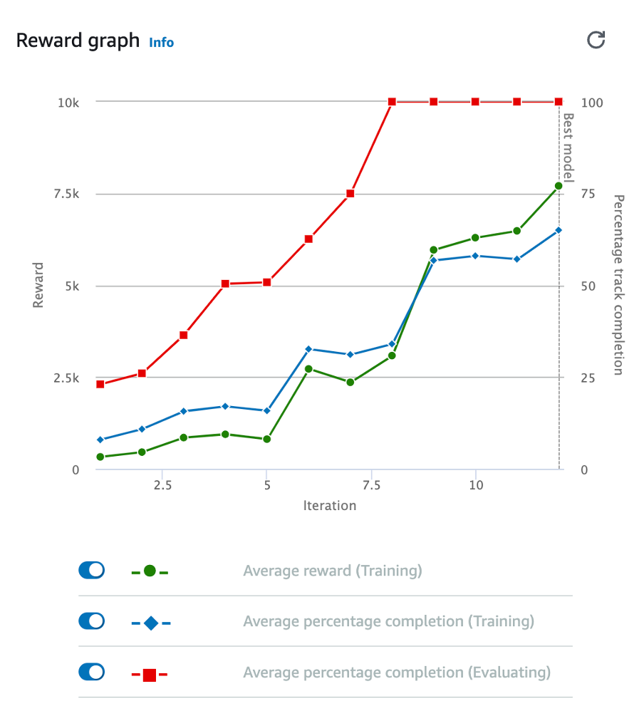
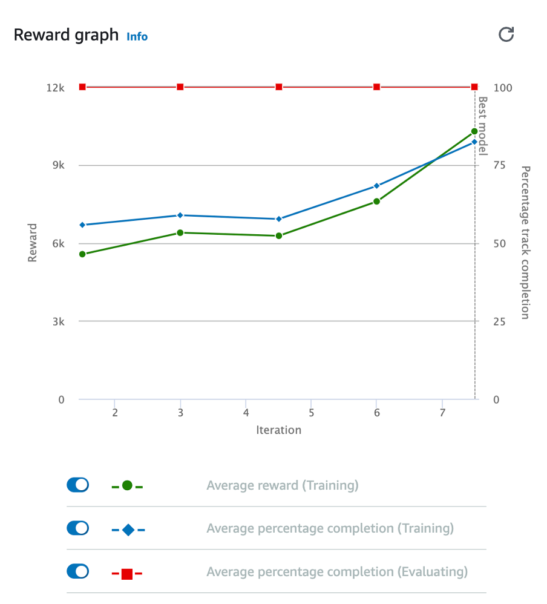
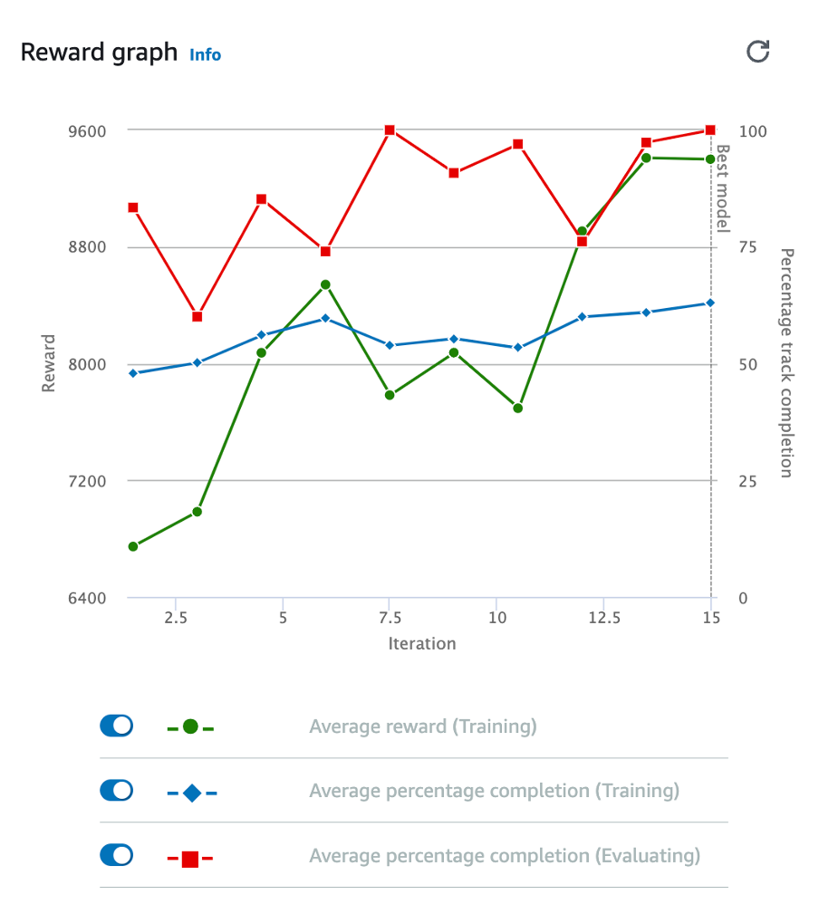
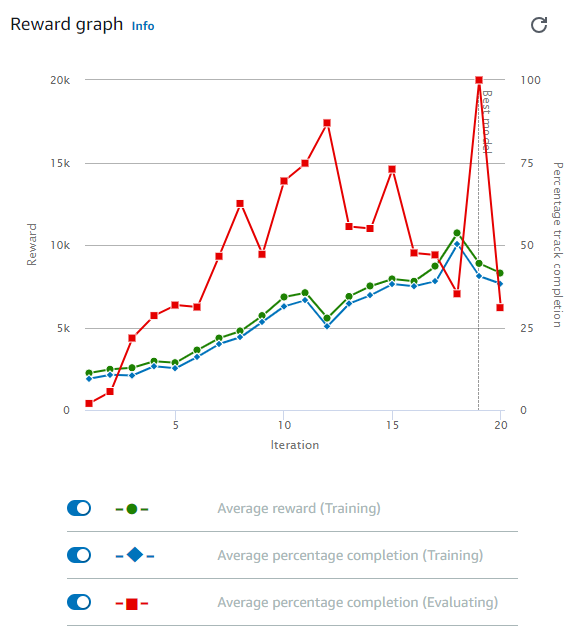

# **Enhancing AWS DeepRacer Physical Track Performance**

This article aims to provide valuable insights and practical recommendations to elevate the performance of AWS DeepRacer on physical racetracks. The determinant of achieving a successful model is the optimal combination of stability, consistency, and speed. This becomes paramount as AWS DeepRacer transcends virtual simulations and confronts the unique challenges presented by physical racetracks. In addition, models constructed by students will be showcased. The relevant information such as hyperparameter selection, action space choice, reward function, and results from the physical track testing will be displayed.

## **Recommendations**

### **Recommendation 1: Start At Lower Speeds**

Speed in the AWS DeepRacer console can be scaled. Begin testing the model at a low speed such as 20%. Gradually increase the speed until the agent moves comfortably. When operating at lower speeds, the agent might encounter halting or stalling issues. In such cases, a simple solution to reset its behaviour is to lift the agent up.

### **Recommendation 2: Train On Different Tracks**

By experiencing different track-specific features, the model gains valuable insights that can equip the agent with adaptability and decision-making skills to handle various challenges. Ultimately, this leads to improved performance on physical racetracks.

### **Recommendation 3: Increase The Minimum Speed**

A low minimum speed can lead to the agent stalling or struggling to initiate movement on the physical racetrack. By setting a more suitable minimum speed, such as 1.3 meters per second, the model gains better momentum and is less likely to encounter halting issues on the physical racetrack.

### **Recommendation 4: Calibrate The Physical Car**

Proper calibration facilitates smooth execution of the learned behaviours and decisions made by the model during training, effectively translating them into real-world actions. By meticulously calibrating the physical car, the agent excels on the physical racetracks.

### **Recommendation 5: Minimise Noise In The Physical Environment**

Background distractions, light reflections, and gaps between barriers can introduce uncertainties that impact the agent’s decision-making. By creating a controlled and focused environment, the agent can better interpret sensor inputs and make accurate navigation choices.

### **Recommendation 6: Proportionally Penalise Off-Track Behaviour**

By discouraging the model from deviating from the track, the agent becomes more adept at staying within the designated boundaries during runs on the physical track.

### **Recommendation 7: Set Up The Track On A Flat Surface**

Bumps or uneven surfaces can hinder the agent's navigation and stability during races, potentially causing the physical car to get stuck. A level and smooth track surface ensures a consistent environment, enabling the agent to execute learned behaviours more effectively and achieve superior performance on physical racetracks.

### **Recommendation 8: Use A Discrete Action Space**

It is advisable to use discrete action spaces instead of continuous ones. Continuous action spaces have demonstrated issues, including significant halts and an inability to complete laps on the physical track.

## **Model 1) StayOnTrack**

This model is all about keeping the agent on the track. It is programmed to earn rewards for staying on the track and penalised when it goes off-track. It was cloned twice with the learning rate being reduced after the initial training. It was trained on the Re:Invent 2018 track.

### **Reward Function**

```python
def reward_function(params):
    reward = 1e-3
    PENALTY = 5.0

    if not params['all_wheels_on_track']:
        reward -= PENALTY * params['distance_from_center']
    else:
        reward += 1

    return float(reward)
```

### **Hyperparameter Selection and Time**

| Hyperparameters and time                                             | Initial | Clone 1 | Clone 2    |
| -------------------------------------------------------------------- | ------- | ------- | ---------- |
| Gradient descent batch size                                          | 64      | 64      | 64         |
| Number of epochs                                                     | 10      | 10      | 10         |
| Learning rate                                                        | 0.001   | 0.00001 | 0.00000001 |
| Entropy                                                              | 0.01    | 0.01    | 0.01       |
| Discount factor                                                      | 0.999   | 0.999   | 0.999      |
| Loss type                                                            | Huber   | Huber   | Huber      |
| Number of experience episodes between each policy-updating iteration | 20      | 20      | 20         |
| Time (mins.)                                                         | 120     | 60      | 120        |

### **Discrete Action Space**

| Action Number | Steering | Speed |
| :-----------: | :------: | :---: |
|       0       |   -30    |  1.4  |
|       1       |   -30    |  1.6  |
|       2       |   -30    |  1.8  |
|       3       |   -15    |  1.4  |
|       4       |   -15    |  1.6  |
|       5       |   -15    |  1.8  |
|       6       |    0     |  1.4  |
|       7       |    0     |  1.6  |
|       8       |    0     |  1.8  |
|       9       |    15    |  1.4  |
|      10       |    15    |  1.6  |
|      11       |    15    |  1.8  |
|      12       |    30    |  1.4  |
|      13       |    30    |  1.6  |
|      14       |    30    |  1.8  |

### **Training Reward Graph**

| Initial                             | Clone 1                            | Clone 2                            |
| ----------------------------------- | ---------------------------------- | ---------------------------------- |
|  |  |  |

### **Simulation Evaluation**

| Trial | Time (MM:SS.mmm) | Trial results (% track completed) | Status       | Off-track | Off-track penalty | Crashes | Crash penalty |
| ----- | ---------------- | --------------------------------- | ------------ | --------- | ----------------- | ------- | ------------- |
| 1     | 00:15.357        | 100%                              | Lap complete | 2         | 4 seconds         | 0       | --            |
| 2     | 00:11.068        | 100%                              | Lap complete | 0         | --                | 0       | --            |
| 3     | 00:10.662        | 100%                              | Lap complete | 0         | --                | 0       | --            |

### **Physical Track Test**

[](https://www.youtube.com/watch?v=EVdQdp2Hi0M)

**Watch the video demonstration [here](https://www.youtube.com/watch?v=EVdQdp2Hi0M).**

## **Model 2) CenterAlignModel**

The CenterAlignModel is designed with the primary objective of centering itself on the track, allowing for accurate steering and a consistent pace. By prioritising this center line alignment strategy, the model aims to navigate the racing environment effectively. It was trained using the Re:Invent 2018 track as the basis for its learning process.

### **Reward Function**

```python
def reward_function(params):

    # Read input parameters.
    all_wheels_on_track = params['all_wheels_on_track']
    progress = params['progress']
    distance_from_center = params['distance_from_center']
    track_width = params['track_width']
    speed = params['speed']
    steering_angle = params['steering_angle']

    # Initialise the reward with a small positive value.
    reward = 1e-3

    # Reward based on progress.
    reward += progress

    # Reward for staying on the track.
    if all_wheels_on_track:
        reward += 10.0
    else:
        reward -= 10.0

    # Calculate 3 markers that are at varying distances away from the center line.
    marker_1 = 0.1 * track_width
    marker_2 = 0.25 * track_width
    marker_3 = 0.5 * track_width

    # Give higher reward if the car is closer to center line and vice versa.
    if distance_from_center <= marker_1:
        reward += 1.0
    elif distance_from_center <= marker_2:
        reward += 0.5
    elif distance_from_center <= marker_3:
        reward += 0.1
    else:
        reward += 1e-3  # likely crashed/close to off track.

    # Reward for maintaining speed.
    reward += speed * 0.2

    # Encourage smooth steering.
    if abs(steering_angle) < 10.0:
        reward += 1.0
    elif abs(steering_angle) < 20.0:
        reward += 0.5
    else:
        reward -= 0.5

    return float(reward)

```

### **Hyperparameter Selection and Time**

| Hyperparameter and time                                              | Initial | Clone 1 | Clone 2 |
| -------------------------------------------------------------------- | ------- | ------- | ------- |
| Gradient descent batch size                                          | 64      | 128     | 128     |
| Entropy                                                              | 0.01    | 0.01    | 0.01    |
| Discount factor                                                      | 0.999   | 0.999   | 0.999   |
| Learning rate                                                        | 0.0003  | 0.0001  | 0.0001  |
| Number of experience episodes between each policy-updating iteration | 20      | 30      | 30      |
| Number of epochs                                                     | 10      | 10      | 10      |
| Time (mins)                                                          | 90      | 90      | 120     |

### **Continuous Action Space**

|     | Speed | Steering |
| --- | :---: | :------: |
| Min | 1.25  |   -30    |
| Max |  2.8  |    30    |

|

### **Training Reward Graph**

| Initial                                                                    | Clone 1                                                                   | Clone 2                                                                   |
| -------------------------------------------------------------------------- | ------------------------------------------------------------------------- | ------------------------------------------------------------------------- |
|  |  |  |

### **Simulation Evaluation**

| Trial | Time (MM:SS.mmm) | Trial results (% track completed) | Status       | Off-track | Off-track penalty | Crashes | Crash penalty |
| ----- | ---------------- | --------------------------------- | ------------ | --------- | ----------------- | ------- | ------------- |
| 1     | 00:10.471        | 100%                              | Lap complete | 0         | --                | 0       | --            |
| 2     | 00:10.592        | 100%                              | Lap complete | 0         | --                | 0       | --            |
| 3     | 00:10.471        | 100%                              | Lap complete | 0         | --                | 0       | --            |

### **Physical Track Test**

[](https://www.youtube.com/watch?v=5wTFzl3KEDo)

**Watch the video demonstration [here](https://www.youtube.com/watch?v=5wTFzl3KEDo).**

## **Model 3) NaviGator**

This reward function guides the DeepRacer vehicle by assessing speed, alignment with the track direction, and steering angle alignment, contributing to effective track navigation. Comprising weighted rewards and penalties, the function facilitates algorithmic learning and adaptation. Speed rewards encourage optimal performance by considering the vehicle's speed relative to predefined limits. Penalties discourage track departures, prioritizing on-track behavior. Alignment with the track direction is vital, with close orientation alignment yielding higher rewards, enhancing turning precision. The reward function also incentivises steering alignment, promoting adherence to optimal trajectories for smoother turns. Ultimately, this comprehensive reward function exemplifies how reinforcement learning shapes intelligent driving behaviors, underlining its significance in autonomous vehicle advancement.

### **Reward Function**

```python
import math
def reward_function(params):

    # Reward weights
    speed_weight = 100
    heading_weight = 100
    steering_weight = 50

    # Initialise the reward based on current speed
    max_speed_reward = 10 * 10
    min_speed_reward = 3.33 * 3.33
    abs_speed_reward = params['speed'] * params['speed']
    speed_reward = (abs_speed_reward - min_speed_reward) / (max_speed_reward - min_speed_reward) * speed_weight

    # Penalise if the car goes off track
    if not params['all_wheels_on_track']:
        return 1e-3

    # Calculate the direction of the center line based on the closest waypoints
    next_point = params['waypoints'][params['closest_waypoints'][1]]
    prev_point = params['waypoints'][params['closest_waypoints'][0]]

    # Calculate the direction in radius, arctan2(dy, dx), the result is (-pi, pi) in radians
    track_direction = math.atan2(next_point[1] - prev_point[1], next_point[0] - prev_point[0])
    # Convert to degree
    track_direction = math.degrees(track_direction)

    # Calculate the difference between the track direction and the heading direction of the car
    direction_diff = abs(track_direction - params['heading'])
    if direction_diff > 180:
        direction_diff = 360 - direction_diff

    abs_heading_reward = 1 - (direction_diff / 180.0)
    heading_reward = abs_heading_reward * heading_weight

    # Reward if steering angle is aligned with direction difference
    abs_steering_reward = 1 - (abs(params['steering_angle'] - direction_diff) / 180.0)
    steering_reward = abs_steering_reward * steering_weight

    return speed_reward + heading_reward + steering_reward
```

### **Hyperparameter Selection and Time**

| Hyperparameter and time                                              | Initial | Clone 1 | Clone 2 | Clone 3 | Clone 4 | Clone 5 | Clone 6 | Clone 7 |
| -------------------------------------------------------------------- | ------- | ------- | ------- | ------- | ------- | ------- | ------- | ------- |
| Gradient descent batch size                                          | 64      | 64      | 64      | 64      | 64      | 64      | 128     | 64      |
| Entropy                                                              | 0.01    | 0.01    | 0.01    | 0.01    | 0.01    | 0.01    | 0.01    | 0.01    |
| Discount factor                                                      | 0.999   | 0.999   | 0.999   | 0.999   | 0.999   | 0.999   | 0.999   | 0.999   |
| Learning rate                                                        | 0.0003  | 0.0003  | 0.0003  | 0.0003  | 0.0003  | 0.0003  | 0.0001  | 0.0003  |
| Number of experience episodes between each policy-updating iteration | 20      | 20      | 20      | 20      | 20      | 20      | 20      | 20      |
| Number of epochs                                                     | 10      | 10      | 10      | 10      | 10      | 10      | 10      | 10      |
| Time (mins)                                                          | 90      | 90      | 90      | 90      | 90      | 90      | 90      | 90      |

### **Discrete Action Space**

| Action Number | Steering | Speed |
| :-----------: | :------: | :---: |
|       0       |   -30    |  1.4  |
|       1       |   -30    |  1.5  |
|       2       |   -30    |  1.8  |
|       3       |   -15    |  1.4  |
|       4       |   -15    |  1.5  |
|       5       |   -15    |  1.8  |
|       6       |    0     |  1.4  |
|       7       |    0     |  1.5  |
|       8       |    0     |  1.8  |
|       9       |    15    |  1.5  |
|      10       |    15    |  1.6  |
|      11       |    15    |  1.8  |
|      12       |    30    |  1.5  |
|      13       |    30    |  1.6  |
|      14       |    30    |  1.8  |

### **Training Reward Graph**

| Initial                                                                    | Clone 1                                                                   | Clone 2                                                                   | Clone 3                                                                   | Clone 4                                                                   | Clone 5                                                                   | Clone 6                                                                   | Clone 7                                                                   |
| -------------------------------------------------------------------------- | ------------------------------------------------------------------------- | ------------------------------------------------------------------------- | ------------------------------------------------------------------------- | ------------------------------------------------------------------------- | ------------------------------------------------------------------------- | ------------------------------------------------------------------------- | ------------------------------------------------------------------------- |
|  |  |  |  |  |  |  |  |

### **Simulation Evaluation**

| Trial | Time (MM:SS.mmm) | Trial results (% track completed) | Status       | Off-track | Off-track penalty | Crashes | Crash penalty |
| ----- | ---------------- | --------------------------------- | ------------ | --------- | ----------------- | ------- | ------------- |
| 1     | 00:11.716        | 100%                              | Lap complete | 0         | --                | 0       | --            |
| 2     | 00:11.732        | 100%                              | Lap complete | 0         | --                | 0       | --            |
| 3     | 00:12.062        | 100%                              | Lap complete | 0         | --                | 0       | --            |

### **Physical Track Test**

[](https://www.youtube.com/watch?v=yUdbHqmEdBk)

**Watch the video demonstration [here](https://www.youtube.com/watch?v=yUdbHqmEdBk).**
